# Drox — agent local en terminal

> **Version produit : `2.0.1`** — ligne active (`2.0.1`)  
> **Moteur** : dérivé du **moteur agent Drox IDE `1.5.0`** (crates Rust partagés : `drox-engine`, outils, permissions, sessions)  
> **Statut** : stabilisation — API et TUI encore évolutifs. Branche **`0.0.0`** clôturée (voir [`docs/0.0.0/README.md`](docs/0.0.0/README.md)).

**Drox TUI** est un client terminal (**`drox-tui`**) pour le moteur d’agent IA **Rust** de l’écosystème Drox. LLM local (Ollama par défaut), outils fichiers / shell / MCP, permissions granulaires et sessions persistantes — **sans service cloud obligatoire**.

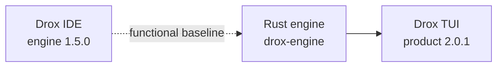

---

## Sommaire (FR)

1. [Démarrage rapide](#démarrage-rapide)
2. [Vue d’ensemble](#vue-densemble)
3. [Architecture du moteur](#architecture-du-moteur)
4. [Boucle agent](#boucle-agent)
5. [Permissions et mode plan](#permissions-et-mode-plan)
6. [Sessions et mémoire](#sessions-et-mémoire)
7. [Interface TUI](#interface-tui-drox-tui)
8. [Configuration](#configuration)
9. [Build et tests](#build-et-tests)
10. [Documentation](#documentation)
11. [English version](#english-version)

---

## Démarrage rapide

**Prérequis** : Rust ≥ 1.85, [Ollama](https://ollama.com/) (ou serveur compatible), terminal moderne (Windows Terminal recommandé).

```sh
cd drox
cargo run -p drox-tui -- --workspace /chemin/vers/projet
```

Au **premier lancement**, le TUI ouvre la modale **Connexion IA** (`Ctrl+Shift+L` ou `/server`) : adresse Ollama, test, choix du modèle, contexte (`num_ctx`) et `max_iterations`. La config est persistée dans `~/.drox/tui-preferences.json`.

Avec flags explicites (sans modale) :

```sh
DROX_SERVER=http://localhost:11434 DROX_MODEL=llama3.2 \
  cargo run -p drox-tui -- --workspace .
```

| Flag / variable | Rôle |
|---|---|
| `--server` / `DROX_SERVER` | URL du serveur LLM |
| `--model` / `DROX_MODEL` | Modèle (sinon choix dans `/server`) |
| `--workspace` / `DROX_WORKSPACE` | Racine des outils (défaut : répertoire courant) |
| `--apply` | Autorise les **écritures disque** (`file_write`, `file_edit`, …) |
| `--plan` / `--mode` | Mode permission (`plan`, `acceptEdits`, `bypassPermissions`, …) |
| `--max-iterations` | Limite de tours agent (défaut 12, configurable dans `/server`) |
| `--session ses_…` | Reprend une session existante |
| `--list-sessions` | Liste les sessions puis quitte |
| `-v` / `-vv` | Logs dans `~/.drox/tui.log` |

---

## Vue d’ensemble

Drox sépare strictement **moteur** (logique agent) et **clients** (TUI, CLI, futurs clients JSON-RPC). Le TUI consomme le même `drox-engine` que le binaire `drox-cli`.

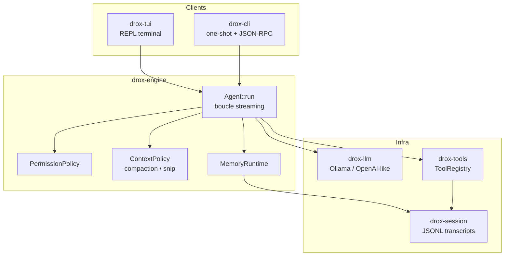

| Couche | Rôle |
|---|---|
| **Client** | Affiche le fil, composer, modales ; traduit clavier → prompts / réponses |
| **Moteur** | Orchestre LLM ↔ outils, streaming d’événements, politique de contexte |
| **Outils** | Effets de bord contrôlés (fichiers, bash, web, MCP, todos, …) |
| **Persistance** | Transcripts JSONL, prefs TUI, règles permissions, mémoire workspace |

---

## Architecture du moteur

Workspace Rust de **12 crates** à dépendances unidirectionnelles :

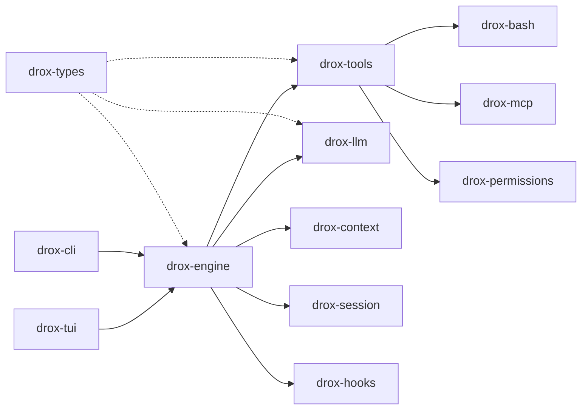

| Crate | Responsabilité |
|---|---|
| `drox-types` | Messages, rôles, `Content`, schémas partagés |
| `drox-llm` | Client LLM (Ollama-first), streaming, retry, `tool_calls` natifs |
| `drox-tools` | ~35 outils : fichiers, grep/glob, bash, web, LSP, MCP, todos, skills, plan… |
| `drox-bash` | Parse Bash / PowerShell, classification sécurité des commandes |
| `drox-mcp` | Protocole MCP (`rmcp`), config `.mcp.json`, OAuth |
| `drox-permissions` | Règles allow / ask / deny, modes, sandbox, plan mode |
| `drox-context` | Estimation tokens, compaction, snip du contexte long |
| `drox-session` | Transcripts JSONL, listing sessions, mémoire archivée, `.droxignore` |
| `drox-hooks` | Hooks pré/post exécution d’outils (`.drox/hooks.json`) |
| `drox-engine` | **`Agent`** : boucle, orchestration parallèle, événements `AgentEvent` |
| `drox-cli` | Binaire `drox`, prompts système, JSON-RPC stdio |
| `drox-tui` | Binaire `drox-tui`, ratatui, ~30 commandes slash |

---

## Boucle agent

Chaque message utilisateur déclenche un **run** : le moteur charge l’historique (transcript), construit le contexte, puis enchaîne des **tours LLM** jusqu’à une condition d’arrêt.

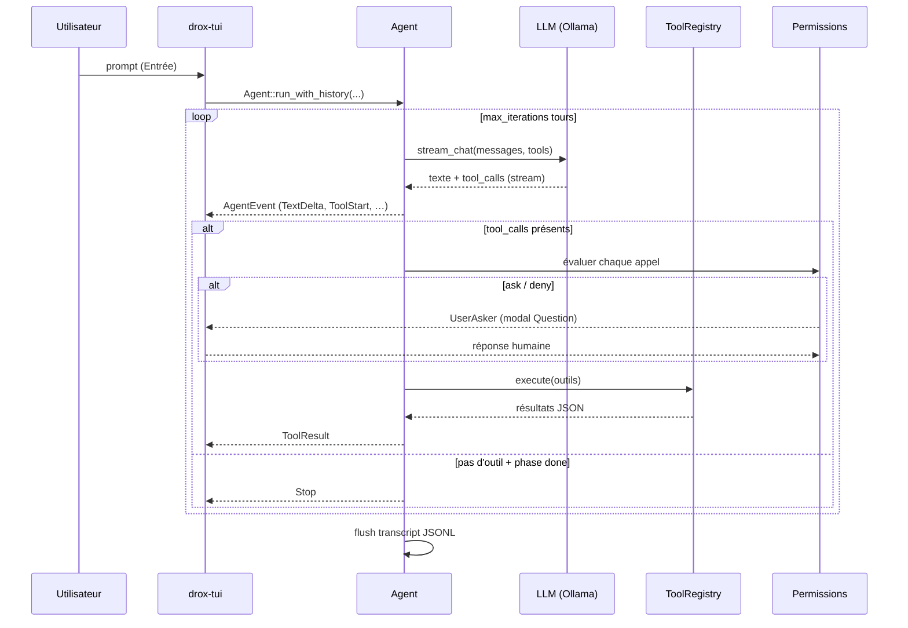

### Phases et streaming

Le modèle peut émettre des marqueurs `[phase: …]` (`reading`, `planning`, `acting`, `verifying`, `clarifying`, `answering`, `done`). Le moteur les parse, les retire du texte affiché et émet `AgentEvent::PhaseEnter` pour le TUI (blocs repliables).

Événements principaux consommés par le TUI :

| `AgentEvent` | Effet UI |
|---|---|
| `TextDelta` | Streaming assistant (markdown) |
| `PhaseEnter` | Bandeau de phase repliable |
| `ToolStart` / `ToolProgress` / `ToolEnd` | Lignes outil + viewers (`e`) |
| `ThinkingDelta` | Raisonnement natif Ollama (si activé) |
| `Stop` / erreur | Fin de run, déblocage composer |

### Outils disponibles (extrait)

| Catégorie | Outils |
|---|---|
| Fichiers | `file_read`, `file_write`, `file_edit`, `notebook_edit`, `delete_path`, `copy_path` |
| Recherche | `grep`, `glob` |
| Shell | `bash` (preview + classification `drox-bash`) |
| Web | `web_fetch`, `web_search` |
| IDE | `lsp` |
| Agent / UX | `ask_user_question`, `exit_plan_mode`, `todo_write`, `task` |
| Mémoire | `session_note`, `session_compact`, `memory_list`, `memory_read`, … |
| MCP | `mcp_list_tools`, `mcp_call_tool`, … |
| Skills / cours | `skill_list`, `skill_read`, `course_plan_write` |

Sans `--apply`, les écritures fichier sont **proposées** (preview diff) mais non appliquées sur disque.

---

## Permissions et mode plan

Les règles viennent de fichiers JSON en couches : `~/.drox/settings.json`, `<workspace>/.drox/settings.json`, flags CLI (`--allow`, `--ask`, `--deny`).

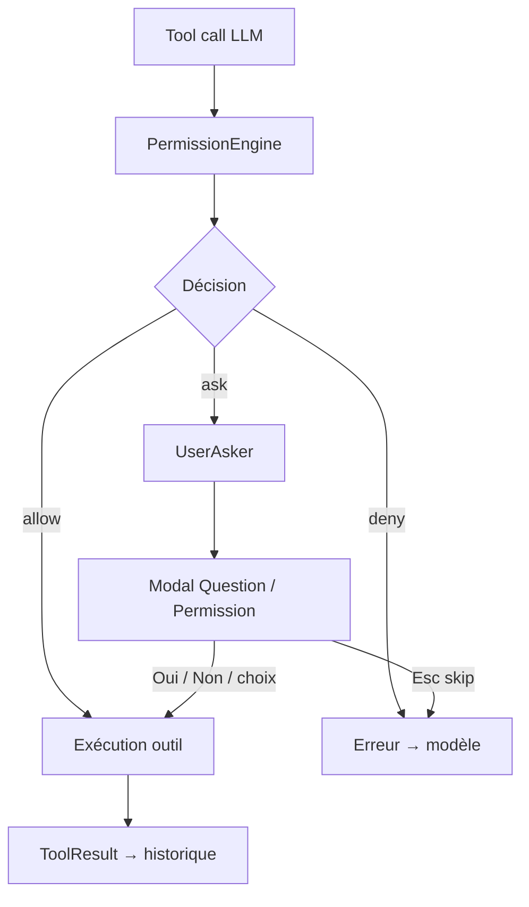

| Mode | Comportement |
|---|---|
| **Défaut** | Écritures et bash souvent en `ask` |
| **`--plan`** | Mode plan : pas d’écriture tant que le plan n’est pas approuvé via `exit_plan_mode` |
| **`--apply`** | Applique réellement les mutations fichier |
| **`acceptEdits`** | Auto-accepte les éditions autorisées |
| **`bypassPermissions`** | Dangereux — contourne les gates (dev uniquement) |

Le TUI affiche des **previews** (diff fichier, commande bash classifiée, URL web, plan markdown) dans la modale avant validation.

---

## Sessions et mémoire

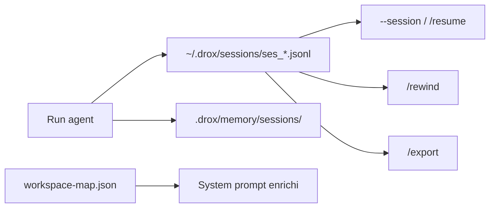

| Élément | Emplacement |
|---|---|
| Transcript session | `~/.drox/sessions/ses_<uuid>.jsonl` |
| Stats UI session | métadonnées adjacentes |
| Préférences TUI | `~/.drox/tui-preferences.json` |
| Keybindings | `~/.drox/keybindings.json` |
| Env Drox | `~/.drox/env`, `<workspace>/.drox/env` |
| Plan mode | `<workspace>/.drox/plan.md` |
| MCP | `<workspace>/.mcp.json` |
| Ignore agent | `<workspace>/.droxignore` |

---

## Interface TUI (`drox-tui`)

REPL terminal (ratatui) branché sur `EngineRuntime` — ~30 commandes slash (`/help`).

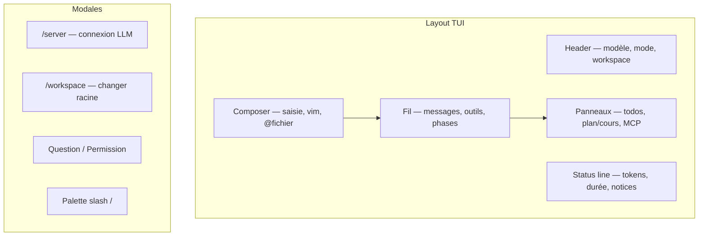

### Agent et fil

- Boucle agent streaming, annulation Esc / Ctrl+C, file de messages
- Markdown assistant, liens OSC 8, viewers scrollables (`e`)
- Compaction contexte (`/compact`), recherche fil `Ctrl+F`

### Composer

- Vim (`/vim`), typeahead `@` / `/` / skills
- Smart paste, images multimodales Ollama
- Mode bash `!` (shell direct sans agent)
- Connexion IA : `Ctrl+Shift+L`, workspace : `Ctrl+Shift+W`

### Personnalisation

- Thèmes `/theme`, accent `/color`
- `/settings`, `/onboarding`, `/keybindings init`
- Logs TUI : `~/.drox/tui.log` (pas de pollution stderr)

---

## Configuration

```text
~/.drox/
├── tui-preferences.json   # thème, LLM, vim, workspaces récents
├── keybindings.json
├── settings.json          # permissions globales
├── env                    # variables DROX_*
└── sessions/
    └── ses_*.jsonl

<workspace>/
├── .drox/
│   ├── env
│   ├── settings.json
│   ├── plan.md            # mode plan
│   └── memory/
├── .droxignore
└── .mcp.json
```

---

## Build et tests

```sh
cd drox
cargo check          # vérification rapide
cargo build -p drox-tui
cargo test -p drox-tui
cargo fmt && cargo clippy
```

Binaire debug : `drox/target/debug/drox-tui`.

---

## Documentation

| Document | Contenu |
|---|---|
| [`docs/2.0.1/README.md`](docs/2.0.1/README.md) | Ligne produit 2.0.1 — moteur IDE 1.5.0, objectifs |
| [`docs/2.0.1/CHECKLIST.md`](docs/2.0.1/CHECKLIST.md) | Checklist tests manuels TUI |
| [`docs/2.0.1/PLAN-I18N-EN.md`](docs/2.0.1/PLAN-I18N-EN.md) | Plan passage UI en anglais |
| [`docs/0.0.0/README.md`](docs/0.0.0/README.md) | Branche 0.0.0 — archivée |
| [`drox/README.md`](drox/README.md) | Architecture crates, conventions Rust |
| [`drox/crates/drox-tui/README.md`](drox/crates/drox-tui/README.md) | Raccourcis et slash commands détaillés |

---

## Licence

MIT — voir [`drox/Cargo.toml`](drox/Cargo.toml).

---

---

# English version

> **Product version: `2.0.1`** — active line (`2.0.1`)  
> **Engine**: derived from **Drox IDE agent engine `1.5.0`** (shared Rust crates: `drox-engine`, tools, permissions, sessions)  
> **Status**: stabilization — API and TUI still evolving. Branch **`0.0.0`** closed (see [`docs/0.0.0/README.md`](docs/0.0.0/README.md)).

**Drox TUI** is a terminal client (**`drox-tui`**) for the **Rust** agent engine in the Drox ecosystem. Local LLM (Ollama by default), file / shell / MCP tools, granular permissions, and persistent sessions — **no mandatory cloud service**.


---

## Table of contents (EN)

1. [Quick start](#quick-start)
2. [Overview](#overview)
3. [Engine architecture](#engine-architecture)
4. [Agent loop](#agent-loop)
5. [Permissions and plan mode](#permissions-and-plan-mode)
6. [Sessions and memory](#sessions-and-memory)
7. [TUI interface](#tui-interface-drox-tui)
8. [Configuration](#configuration-1)
9. [Build and tests](#build-and-tests)
10. [Documentation](#documentation-1)
11. [License](#license)

---

## Quick start

**Requirements**: Rust ≥ 1.85, [Ollama](https://ollama.com/) (or compatible server), modern terminal (Windows Terminal recommended).

```sh
cd drox
cargo run -p drox-tui -- --workspace /path/to/project
```

On **first launch**, the TUI opens the **AI server** modal (`Ctrl+Shift+L` or `/server`): Ollama URL, connection test, model pick, context window (`num_ctx`), and `max_iterations`. Settings persist in `~/.drox/tui-preferences.json`.

With explicit flags (skip modal):

```sh
DROX_SERVER=http://localhost:11434 DROX_MODEL=llama3.2 \
  cargo run -p drox-tui -- --workspace .
```

| Flag / env | Role |
|---|---|
| `--server` / `DROX_SERVER` | LLM server URL |
| `--model` / `DROX_MODEL` | Model (otherwise chosen in `/server`) |
| `--workspace` / `DROX_WORKSPACE` | Tool root directory (default: cwd) |
| `--apply` | Allow **disk writes** (`file_write`, `file_edit`, …) |
| `--plan` / `--mode` | Permission mode (`plan`, `acceptEdits`, `bypassPermissions`, …) |
| `--max-iterations` | Agent turn limit (default 12, configurable in `/server`) |
| `--session ses_…` | Resume an existing session |
| `--list-sessions` | List sessions and exit |
| `-v` / `-vv` | Logs to `~/.drox/tui.log` |

---

## Overview

Drox strictly separates **engine** (agent logic) from **clients** (TUI, CLI, future JSON-RPC clients). The TUI uses the same `drox-engine` as the `drox-cli` binary.

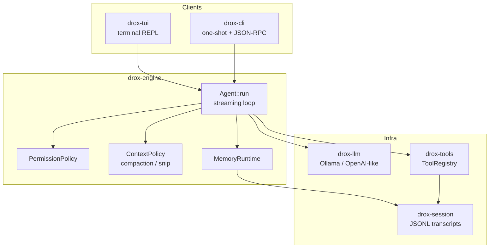

| Layer | Role |
|---|---|
| **Client** | Renders transcript, composer, modals; maps keyboard → prompts / answers |
| **Engine** | Orchestrates LLM ↔ tools, event streaming, context policy |
| **Tools** | Controlled side effects (files, bash, web, MCP, todos, …) |
| **Persistence** | JSONL transcripts, TUI prefs, permission rules, workspace memory |

---

## Engine architecture

Rust workspace of **12 crates** with one-way dependencies:


| Crate | Responsibility |
|---|---|
| `drox-types` | Messages, roles, `Content`, shared schemas |
| `drox-llm` | LLM client (Ollama-first), streaming, retry, native `tool_calls` |
| `drox-tools` | ~35 tools: files, grep/glob, bash, web, LSP, MCP, todos, skills, plan… |
| `drox-bash` | Bash / PowerShell parse, command safety classification |
| `drox-mcp` | MCP protocol (`rmcp`), `.mcp.json` config, OAuth |
| `drox-permissions` | allow / ask / deny rules, modes, sandbox, plan mode |
| `drox-context` | Token estimation, compaction, long-context snip |
| `drox-session` | JSONL transcripts, session listing, archived memory, `.droxignore` |
| `drox-hooks` | Pre/post tool hooks (`.drox/hooks.json`) |
| `drox-engine` | **`Agent`**: loop, parallel orchestration, `AgentEvent` stream |
| `drox-cli` | `drox` binary, system prompts, JSON-RPC stdio |
| `drox-tui` | `drox-tui` binary, ratatui, ~30 slash commands |

---

## Agent loop

Each user message triggers a **run**: the engine loads history (transcript), builds context, then iterates **LLM turns** until a stop condition.


### Phases and streaming

The model may emit `[phase: …]` markers (`reading`, `planning`, `acting`, `verifying`, `clarifying`, `answering`, `done`). The engine parses them, strips them from displayed text, and emits `AgentEvent::PhaseEnter` for collapsible UI blocks.

Main events consumed by the TUI:

| `AgentEvent` | UI effect |
|---|---|
| `TextDelta` | Assistant streaming (markdown) |
| `PhaseEnter` | Collapsible phase banner |
| `ToolStart` / `ToolProgress` / `ToolEnd` | Tool lines + viewers (`e`) |
| `ThinkingDelta` | Native Ollama reasoning (if enabled) |
| `Stop` / error | End run, unlock composer |

### Available tools (sample)

| Category | Tools |
|---|---|
| Files | `file_read`, `file_write`, `file_edit`, `notebook_edit`, `delete_path`, `copy_path` |
| Search | `grep`, `glob` |
| Shell | `bash` (preview + `drox-bash` classification) |
| Web | `web_fetch`, `web_search` |
| IDE | `lsp` |
| Agent / UX | `ask_user_question`, `exit_plan_mode`, `todo_write`, `task` |
| Memory | `session_note`, `session_compact`, `memory_list`, `memory_read`, … |
| MCP | `mcp_list_tools`, `mcp_call_tool`, … |
| Skills / course | `skill_list`, `skill_read`, `course_plan_write` |

Without `--apply`, file writes are **previewed** (diff) but not applied to disk.

---

## Permissions and plan mode

Rules come from layered JSON: `~/.drox/settings.json`, `<workspace>/.drox/settings.json`, CLI flags (`--allow`, `--ask`, `--deny`).

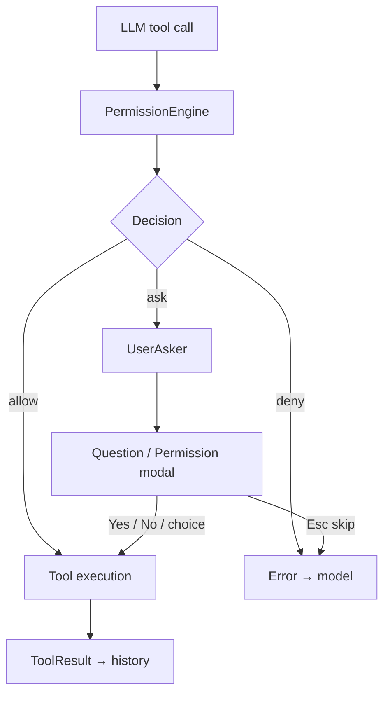

| Mode | Behavior |
|---|---|
| **Default** | Writes and bash often `ask` |
| **`--plan`** | Plan mode: no writes until plan approved via `exit_plan_mode` |
| **`--apply`** | Actually applies file mutations |
| **`acceptEdits`** | Auto-accept allowed edits |
| **`bypassPermissions`** | Dangerous — skips gates (dev only) |

The TUI shows **previews** (file diff, classified bash command, web URL, markdown plan) in the modal before approval.

---

## Sessions and memory

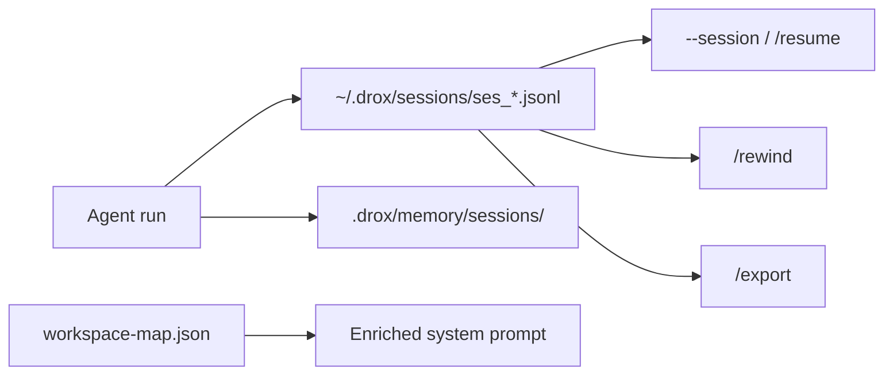

| Item | Location |
|---|---|
| Session transcript | `~/.drox/sessions/ses_<uuid>.jsonl` |
| Session UI stats | adjacent metadata |
| TUI preferences | `~/.drox/tui-preferences.json` |
| Keybindings | `~/.drox/keybindings.json` |
| Drox env | `~/.drox/env`, `<workspace>/.drox/env` |
| Plan mode | `<workspace>/.drox/plan.md` |
| MCP | `<workspace>/.mcp.json` |
| Agent ignore | `<workspace>/.droxignore` |

---

## TUI interface (`drox-tui`)

Terminal REPL (ratatui) on `EngineRuntime` — ~30 slash commands (`/help`).

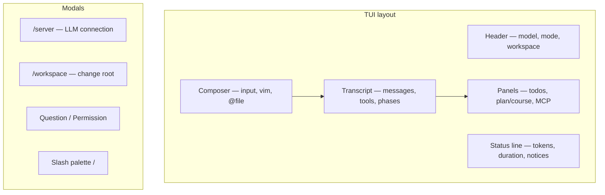

### Agent and transcript

- Streaming agent loop, cancel Esc / Ctrl+C, message queue
- Assistant markdown, OSC 8 links, scrollable viewers (`e`)
- Context compaction (`/compact`), transcript search `Ctrl+F`

### Composer

- Vim (`/vim`), typeahead `@` / `/` / skills
- Smart paste, Ollama multimodal images
- Bash mode `!` (direct shell without agent)
- AI server: `Ctrl+Shift+L`, workspace: `Ctrl+Shift+W`

### Customization

- Themes `/theme`, accent `/color`
- `/settings`, `/onboarding`, `/keybindings init`
- TUI logs: `~/.drox/tui.log` (no stderr pollution)

---

## Configuration

```text
~/.drox/
├── tui-preferences.json   # theme, LLM, vim, recent workspaces
├── keybindings.json
├── settings.json          # global permissions
├── env                    # DROX_* variables
└── sessions/
    └── ses_*.jsonl

<workspace>/
├── .drox/
│   ├── env
│   ├── settings.json
│   ├── plan.md            # plan mode
│   └── memory/
├── .droxignore
└── .mcp.json
```

---

## Build and tests

```sh
cd drox
cargo check
cargo build -p drox-tui
cargo test -p drox-tui
cargo fmt && cargo clippy
```

Debug binary: `drox/target/debug/drox-tui`.

---

## Documentation

| Document | Content |
|---|---|
| [`docs/2.0.1/README.md`](docs/2.0.1/README.md) | Product line 2.0.1 — IDE engine 1.5.0, goals |
| [`docs/2.0.1/CHECKLIST.md`](docs/2.0.1/CHECKLIST.md) | Manual TUI test checklist |
| [`docs/2.0.1/PLAN-I18N-EN.md`](docs/2.0.1/PLAN-I18N-EN.md) | UI English migration plan |
| [`docs/0.0.0/README.md`](docs/0.0.0/README.md) | Branch 0.0.0 — archived |
| [`drox/README.md`](drox/README.md) | Crate architecture, Rust conventions |
| [`drox/crates/drox-tui/README.md`](drox/crates/drox-tui/README.md) | Shortcuts and slash commands |

---

## License

MIT — see [`drox/Cargo.toml`](drox/Cargo.toml).
