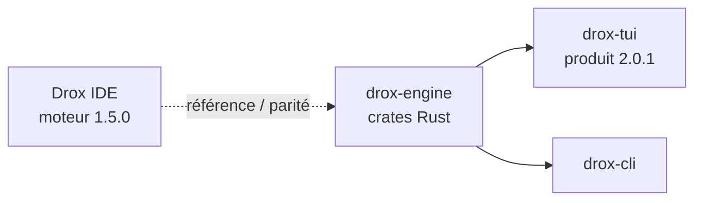

# Ligne produit `2.0.1` — Drox TUI

**Version produit** : `2.0.1`  
**Branche Git** : `2.0.1`  
**Moteur** : dérivé du **moteur agent Drox IDE `1.5.0`** (rewrite Rust partagé : boucle agent, outils, permissions, sessions, MCP).

---

## Positionnement

| Version | Périmètre |
|---|---|
| **IDE Drox — moteur `1.5.0`** | Agent intégré à l''IDE (extension / JSON-RPC), référence fonctionnelle |
| **Drox TUI — produit `2.0.1`** | Client terminal autonome (`drox-tui`) branché sur le **même socle moteur** que la 1.5.0, packaging et UX REPL dédiés |

Ce dépôt n''est pas une branche « 0.x » du moteur : c''est un **produit dérivé** numéroté **`2.0.1`**, aligné sur les capacités du moteur **1.5.0** de l''IDE Drox (tools, permissions, plan mode, compaction, hooks, MCP, etc.).



---

## Objectifs de la ligne `2.0.1`

1. **Parité moteur** avec le socle 1.5.0 IDE (comportement agent, outils, permissions).
2. **Expérience TUI** complète : fil, composer, modales, sessions, personnalisation.
3. **Stabilisation** avant diffusion plus large (tests manuels + `cargo test -p drox-tui`).
4. **Documentation** bilingue (README racine) et préparation i18n UI (voir [`PLAN-I18N-EN.md`](PLAN-I18N-EN.md)).

Héritage de la branche clôturée **`0.0.0`** : base TUI validée (connexion LLM persistante, `/server`, `/workspace`, layout, modales Question). Voir [`docs/0.0.0/README.md`](../0.0.0/README.md).

---

## Prérequis

- Rust ≥ 1.85 (`drox/rust-toolchain.toml`)
- [Ollama](https://ollama.com/) ou serveur compatible
- Terminal moderne (Windows Terminal recommandé)

```powershell
cd drox
cargo build -p drox-tui
cargo run -p drox-tui -- --workspace C:\chemin\vers\projet
```

Configuration LLM : modale au premier lancement (`Ctrl+Shift+L`) ou `~/.drox/tui-preferences.json`.

---

## Tests & qualité

- Checklist manuelle : [`CHECKLIST.md`](CHECKLIST.md)
- Tests automatisés : `cargo test -p drox-tui`
- Logs : `~/.drox/tui.log` (`-v`)

---

## Livrables `2.0.1`

- [ ] Checklist parcourue (Windows + terminal moderne)
- [ ] Parité documentée avec moteur IDE 1.5.0 (écarts listés si any)
- [ ] Tag `v2.0.1` lorsque la ligne est jugée stable

---

## Références

- [`README.md`](../../README.md) — vue d''ensemble, schémas architecture
- [`drox/README.md`](../../drox/README.md) — crates Rust
- [`drox/crates/drox-tui/README.md`](../../drox/crates/drox-tui/README.md) — raccourcis et slash commands