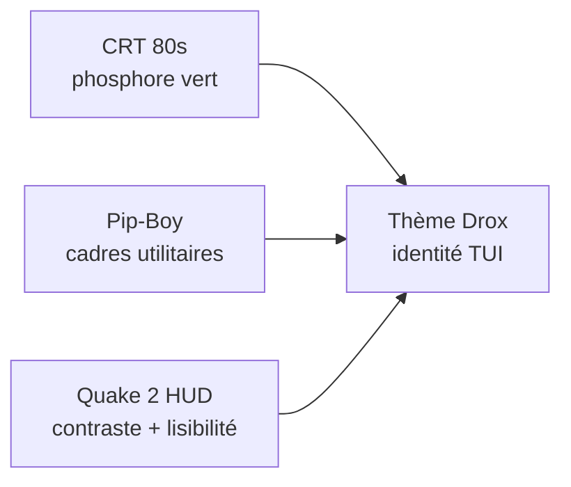

# Charte graphique Drox TUI — v2.0.2

> Document de référence pour l'identité visuelle, les interactions et le ton de la phase UI.

---

## 1. Vision

**Drox TUI** doit évoquer un **terminal militaire / scientifique des années 80**, réinterprété avec le soin d'un HUD de jeu moderne.

| Référence | Ce qu'on en retient |
|---|---|
| **Quake 2** | HUD industriel sombre, contrastes nets, texte monospace lisible, sensation « opérationnelle » |
| **Fallout — Pip-Boy** | Monochrome vert ambre/vert, cadres arrondis *visuels* (simulés en ASCII), scanlines, interface utilitaire |
| **Terminaux CRT 80s** | Phosphore vert sur fond noir, curseur clignotant, légère afterglow, bruit visuel maîtrisé |

**Mot-clé produit** : *phosphor terminal* — pas du cyberpunk rainbow, pas du flat Material Design.



---

## 2. Palette couleur

### 2.1 Thème principal `drox` (défaut 2.0.2)

| Token | Rôle | Valeur suggérée | Notes |
|---|---|---|---|
| `bg-deep` | Fond principal | `#0a0e0a` | Noir légèrement verdâtre |
| `bg-panel` | Panneaux, modales | `#0f1410` | +1 niveau de profondeur |
| `bg-elevated` | Composer, header | `#141a14` | Zone de saisie active |
| `phosphor-primary` | Texte principal, bordures actives | `#33ff66` | Vert phosphore (lisible) |
| `phosphor-dim` | Texte secondaire | `#1a9933` | Labels, métadonnées |
| `phosphor-bright` | Focus, sélection, accent | `#66ff99` | Surbrillance |
| `phosphor-glow` | Animation pulse | `#00ff41` | Curseur, indicateurs live |
| `amber-alert` | Avertissements, mode plan | `#ffb000` | Pip-Boy warning (usage parcimonieux) |
| `red-critical` | Erreurs, deny | `#ff3333` | Permissions refusées |
| `scanline` | Overlay CRT (option) | `#33ff6620` | 12–15 % opacité, lignes horizontales |

### 2.2 Règles d'usage

- **Fond toujours sombre** — jamais de blanc plein en thème Drox.
- **Une couleur d'action** — le vert phosphore ; l'ambre uniquement pour alertes / plan mode.
- **Contraste WCAG** — viser ratio ≥ 4.5:1 entre `phosphor-primary` et `bg-deep` (ajuster si besoin sur terminaux 16 couleurs).
- **Fallback ANSI** — variante `drox-ansi` : Green + Black pour terminaux sans truecolor.

### 2.3 Mapping ratatui

Implémenté dans `theme.rs` — voir **[THEME.md](../THEME.md)** (document normatif portable).

| Composant UI | Couleurs |
|---|---|
| Header | `phosphor-primary` / `phosphor-dim` |
| Bordures inactives | `phosphor-dim` |
| Bordures focus | `phosphor-bright` |
| Composer | bordure `phosphor-glow` actif ; `phosphor-dim` bloqué |
| Fil assistant | texte `phosphor-primary` ; code blocks fond `bg-panel` |
| Modales | fond `bg-panel`, sélection `phosphor-bright` |
| Status line | `phosphor-dim` ; tokens en `phosphor-primary` |

`/color` (accent session) reste disponible mais **désactivé ou limité** en thème Drox strict (option : teinte légère du phosphore uniquement).

---

## 3. Typographie et forme

| Élément | Spec |
|---|---|
| **Police** | Monospace obligatoire — priorité : police du terminal utilisateur ; recommander *IBM Plex Mono*, *JetBrains Mono*, *Consolas* |
| **Densité** | Compacte mais aérée — padding 1 cellule minimum dans modales |
| **Cadres** | Box-drawing `┌─┐│└─┘` style terminal ; coins « Pip-Boy » simulés avec `╭─╮` / `╰─╯` sur modales principales |
| **Titres** | MAJUSCULES ou *Small caps* simulés (`DROX TUI`, `CONNEXION IA`) |
| **Séparateurs** | Lignes `─` ou `═` ; jamais de Unicode décoratif excessif |
| **Icônes** | ASCII d'abord (`[+]`, `[>]`, `[*]`, `[!]`) ; pas d'emoji en UI par défaut |

---

## 4. Layout et composants

```text
┌─ DROX TUI ─ v2.0.2 ─ llama3.2 ─ plan ─────────────────────────┐
│ workspace: ~/projets/mon-repo                    [●] CONNECTÉ  │
├─────────────────────────────────────────────────────────────────┤
│ ▼ PHASE: acting                                                 │
│ ┌ assistant ─────────────────────────────────────────────────┐  │
│ │ Réponse streaming markdown…                                │  │
│ └────────────────────────────────────────────────────────────┘  │
│ ▶ tool: file_read  path.rs                          [e] voir   │
├─────────────── panneau latéral (todos / plan) ──────────────────┤
│ > composer clignotant_                                        │
├─────────────────────────────────────────────────────────────────┤
│ tokens: 12.4k │ durée: 3.2s │ mode: plan │ FR │ souris: on     │
└─────────────────────────────────────────────────────────────────┘
```

| Zone | Comportement visuel |
|---|---|
| **Header** | Bandeau fixe, statut connexion LLM (pastille verte/ambre/rouge) |
| **Fil** | Scroll vertical ; phases repliables ; hover souris sur lignes outil |
| **Panneaux** | Split redimensionnable (souris) ; bordure phosphore à focus |
| **Composer** | Curseur block clignotant ; bordure animée pendant run |
| **Modales** | Centrées, fond `bg-panel`, titre cadre Pip-Boy, boutons `[ Oui ]` `[ Non ]` cliquables |
| **Status** | Infos système discrètes ; langue UI ; indicateur souris active |

---

## 5. Interactions — souris et clavier

> **Objectif** : parité d'usage. Un utilisateur souris-only doit pouvoir naviguer ; un power-user clavier ne doit rien perdre.

### 5.1 Souris (nouveau)

| Action | Comportement |
|---|---|
| **Clic** | Focus zone ; validation boutons modales ; sélection item liste |
| **Double-clic** | Ouvrir viewer outil (`e`) ; expand phase |
| **Molette** | Scroll fil, modales, viewers |
| **Drag** | Redimensionner split panneau (si applicable) |
| **Hover** | Surbrillance ligne outil / choix modal ; tooltip texte court |
| **Clic droit** | Menu contextuel minimal (copier, expand) — phase 2.0.2+ si temps |

**Implémentation** : activer `EnableMouseCapture` crossterm ; hit-testing par zone dans `app/run.rs` ; états `hover_id` / `focused_widget`.

### 5.2 Clavier (conservé et enrichi)

- Tous les raccourcis actuels restent (`Ctrl+Shift+L`, `/`, `Esc`, `e`, …).
- **Focus visible** : même widget ciblé souris ou clavier (`Tab` / `Shift+Tab` dans modales).
- **Hints** : footer modal affiche `Entrée` / `Esc` / `clic` selon contexte.

### 5.3 Préférence utilisateur

`/settings` → `mouse: on | off` (défaut : **on** si terminal le supporte).

---

## 6. Animations — mélange retro et polish

### 6.1 Principes

| Faire | Éviter |
|---|---|
| Animations **courtes** (80–300 ms) | Transitions longues, blur impossible en TUI |
| Effets **suggestifs** du CRT | Faux 3D, particules lourdes |
| **60 fps max** via tick rate maîtrisé | Redraw complet inutile chaque frame |
| Désactivables (`/settings animations: off`) | Animations obligatoires bloquantes |

### 6.2 Catalogue d'effets

| ID | Effet | Où | Technique |
|---|---|---|---|
| `cursor-blink` | Curseur block clignotant | Composer | Toggle style 530 ms |
| `phosphor-pulse` | Bordure composer pulse | Composer actif | Alternance `phosphor-primary` / `phosphor-glow` |
| `scanline-overlay` | Lignes CRT subtiles | Fond global (option) | Ligne sur 3 en `phosphor-dim` 8 % |
| `type-reveal` | Caractères qui « s'allument » | Boot, connexion LLM | Affichage progressif string |
| `handshake` | Séquence connexion serveur | Modal `/server` test | `[=====>    ] PROBE… OK` animé |
| `stream-glow` | Dernière ligne assistant pulse | Fil streaming | Dim → bright sur delta |
| `phase-slide` | Entrée bandeau phase | PhaseEnter | 1 ligne insert + fade dim |
| `modal-in` | Apparition modale | Toutes modales | Draw cadre progressif (4 frames) |
| `status-tick` | Compteur durée | Status line | Update 1 Hz |

### 6.3 Boot / connexion (signature Drox)

Séquence optionnelle au premier lancement ou `/server` test :

```text
[ DROX TUI v2.0.2 ]
> initialisation terminal... OK
> chargement preferences... OK
> liaison serveur IA........ [=========>  ] 
```

Ton **diegetic** : le TUI se comporte comme un équipement in-universe (Pip-Boy / terminal Quake).

---

## 7. i18n — FR / EN

Voir [PLAN-I18N.md](PLAN-I18N.md).

Résumé charte :

- **Langue UI** indépendante de la langue des prompts agent.
- Choix dans `/settings` → `language: fr | en`.
- Chaînes modales, menus, notices, onboarding traduits.
- **Défaut** : détecter locale OS ; fallback `en`.

---

## 8. Connexions LLM — bibliothèque

Voir [PLAN-CONNEXIONS-LLM.md](PLAN-CONNEXIONS-LLM.md).

Résumé charte (UX modal `/server`) :

```text
┌─ CONNEXION IA ────────────────────────────────────────────────┐
│ Profil: [ Ollama local ▼ ]  [ + Nouveau profil ]              │
│                                                               │
│  ● Ollama local      http://127.0.0.1:11434                   │
│  ○ Ollama Cloud      https://ollama.com    (Bearer ****)      │
│  ○ vLLM              https://...           (API-Key ****)     │
│  ○ Personnalisé      Mon serveur perso                         │
│                                                               │
│  [ Tester ]  [ Enregistrer ]  [ Annuler ]                     │
└───────────────────────────────────────────────────────────────┘
```

Presets = bonnes pratiques headers ; custom = liberté totale.

---

## 9. Phases d'implémentation

| Phase | Livrable | Priorité |
|---|---|---|
| **P0** | Thème `drox` + palette | Haute |
| **P1** | Souris : scroll, clic modales, focus | Haute |
| **P2** | Animations cursor + pulse + modal-in | Moyenne |
| **P3** | i18n FR/EN (strings critiques) | Haute |
| **P4** | Bibliothèque connexions LLM | Haute |
| **P5** | Scanline overlay + boot sequence | Basse |
| **P6** | Thèmes legacy conservés en `/theme` | Basse |

---

## 10. Critères d'acceptation visuels

- [ ] Thème Drox actif par défaut sur nouvelle install.
- [ ] Écran `/server` utilisable entièrement à la souris.
- [ ] Composer : curseur clignotant + bordure pulse pendant run.
- [ ] Modal Question : choix cliquables + navigation clavier.
- [ ] FR et EN switchables sans redémarrage.
- [ ] Preset Ollama Cloud + profil custom sauvegardés et testables.
- [ ] Lisible sur Windows Terminal truecolor **et** fallback 16 couleurs.

---

## 11. Références visuelles (moodboard)

- Terminal IBM 3270 — vert phosphore sur noir
- Quake 2 status bar — HUD minimal, monospace
- Fallout 3/4 Pip-Boy — cadres, vert/ambre, utilitarisme
- Alien (1979) MU-TH-UR interface — typographie machine

*Ce document est normatif pour la ligne 2.0.2. Toute déviation doit être documentée ici.*
