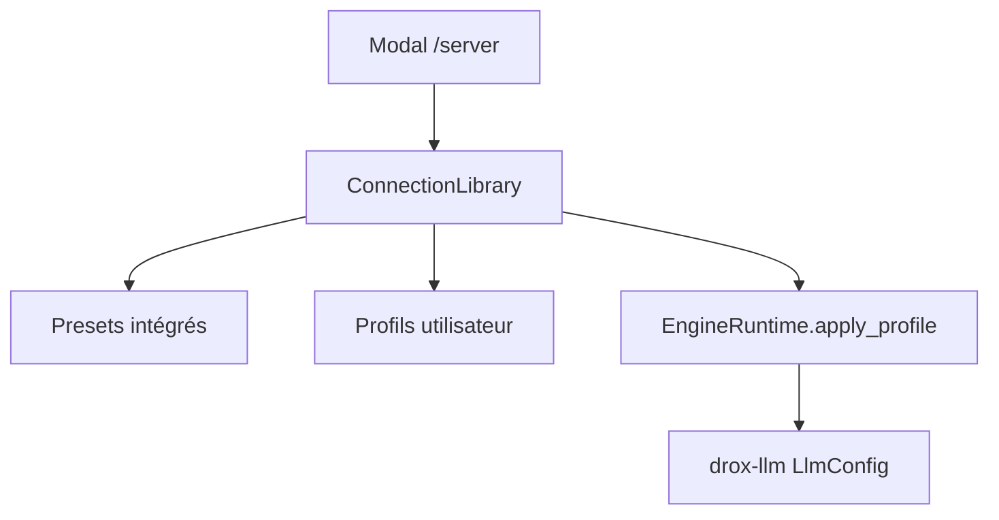

# Plan — Bibliothèque de connexions LLM (ligne 2.0.2)

**Statut** : en cours — assistant `/server` terminé (étapes 1–4) ; charte Drox UI à appliquer (étape 4 bis)  
**Objectif** : permettre à l'utilisateur de se connecter facilement aux **hébergeurs cloud connus** (Ollama Cloud, vLLM managé, etc.) **et** de définir des **profils personnalisés** pour serveurs perso (headers, tokens, URL).

---

## Problème actuel

- Un seul moteur : `LlmEngineKind::Ollama` (`preferences.rs`).
- Connexion = URL + `api_key` optionnelle ; pas de presets ni headers custom dans le TUI.
- Le moteur `drox-llm` supporte déjà `LlmConfig.headers: BTreeMap<String, String>` — **non exposé** dans l'UI TUI.
- Cas réels :
  - **Ollama local** : `http://127.0.0.1:11434`, sans auth.
  - **Ollama Cloud** : URL + token Bearer officiel.
  - **Serveur perso** : reverse proxy + `X-Api-Key` custom ou header maison ≠ doc Ollama.

---

## Modèle cible



---

## Types de données

### `ConnectionProfile` (persisté)

```rust
pub struct ConnectionProfile {
    pub id: String,              // uuid stable
    pub name: String,            // "Mon NAS Ollama"
    pub provider: LlmProvider,    // preset ou Custom
    pub base_url: String,
    pub default_model: Option<String>,
    pub auth: AuthConfig,
    pub extra_headers: BTreeMap<String, String>,
    pub num_ctx: i64,
    pub max_iterations: usize,
    pub created_at: Option<String>,
}

pub enum LlmProvider {
    OllamaLocal,
    OllamaCloud,
    Vllm,
    OpenAiCompatible,
    LmStudio,
    Custom,
}

pub enum AuthConfig {
    None,
    Bearer { token: SecretString },
    ApiKeyHeader { header_name: String, token: SecretString },
    CustomHeaders, // tout dans extra_headers
}
```

Stockage : `~/.drox/tui-preferences.json` → `connection_profiles: Vec<ConnectionProfile>` + `active_profile_id`.

**Secrets** : tokens en clair local (comme aujourd'hui `api_key`) ; documenter risque ; option future OS keychain.

---

## Presets intégrés (non supprimables, dupliquables)

| ID preset | Provider | URL par défaut | Auth | Headers typiques |
|---|---|---|---|---|
| `ollama-local` | OllamaLocal | `http://127.0.0.1:11434` | None | — |
| `ollama-cloud` | OllamaCloud | `https://ollama.com` | Bearer | `Authorization: Bearer <token>` |
| `vllm-openai` | Vllm | `http://127.0.0.1:8000/v1` | ApiKeyHeader | `Authorization: Bearer <key>` (OpenAI compat) |
| `lm-studio` | LmStudio | `http://127.0.0.1:1234/v1` | None / Bearer | selon doc LM Studio |
| `openai-compatible` | OpenAiCompatible | *(vide)* | ApiKeyHeader | `Authorization: Bearer` |

Chaque preset pré-remplit le formulaire ; l'utilisateur ajuste URL/token avant test.

### Profil custom

- Nom libre, `provider: Custom`.
- Champs : URL, modèle, **table headers** (clé/valeur), auth optionnelle.
- Cas d'usage : nginx + `X-Ollama-Token`, Cloudflare Access, gateway perso.

---

## UX modal `/server` (refonte)

### Écran 1 — Choix profil

```text
┌─ CONNEXION IA ────────────────────────────────────────────────┐
│ Profil actif: Mon serveur NAS                                 │
│                                                               │
│  > Ollama local (preset)                                      │
│    Ollama Cloud (preset)                                      │
│    vLLM OpenAI-compat (preset)                                │
│  > Mon serveur NAS (custom)                                   │
│  > + Créer un profil                                          │
│                                                               │
│  [ Tester ]  [ Appliquer ]  [ Supprimer ]  [ Annuler ]        │
└───────────────────────────────────────────────────────────────┘
```

### Écran 2 — Édition profil

| Champ | Widget |
|---|---|
| Nom | input |
| Type / preset base | dropdown |
| URL serveur | input + validation URL |
| Authentification | None / Bearer / Header custom |
| Token | input masqué |
| Headers additionnels | liste editable (souris + clavier) |
| Modèle | dropdown après test, ou saisie manuelle |
| num_ctx / max_iterations | presets existants |

**Tester** : réutilise `probe_ollama` généralisé → `probe_connection(profile) -> Result<Vec<String>, Error>`.

---

## Couche moteur

### Generaliser au-delà d'Ollama

Court terme 2.0.2 :

- Garder `OllamaClient` pour API Ollama native.
- Profiles `OpenAiCompatible` / `vllm` : client OpenAI-like existant ou extension `drox-llm` (à auditer).

```rust
pub fn profile_to_llm_config(profile: &ConnectionProfile) -> Result<LlmConfig, LlmError>;
```

Mapping auth :

| AuthConfig | LlmConfig |
|---|---|
| None | headers vide |
| Bearer | `Authorization: Bearer {token}` |
| ApiKeyHeader | `{header_name}: {token}` |
| CustomHeaders | merge `extra_headers` |

---

## Migration depuis 2.0.1

Au chargement prefs :

1. Si `llm_connection` legacy présent → migrer vers profil `ollama-local` ou custom auto-nommé « Import 2.0.1 ».
2. Conserver champs legacy en lecture seule une version.

---

## Bonnes pratiques sécurité (doc utilisateur)

- Ne jamais committer tokens dans workspace git.
- Profils stockés localement uniquement.
- Indication visuelle si connexion distante (header ambre « REMOTE LLM »).

---

## Tests

| Test | Attendu |
|---|---|
| Preset Ollama local | Liste modèles localhost |
| Preset + Bearer | Header envoyé (mock HTTP) |
| Custom headers | Deux headers merge dans requête |
| Migration 2.0.1 | Ancienne prefs → profil actif |
| UI souris | Sélection profil au clic |

---

## Planning

| Étape | Tâche |
|---|---|
| 1 | Types `ConnectionProfile`, persistence |
| 2 | Presets + migration legacy |
| 3 | `profile_to_llm_config` + probe généralisé |
| 4 | Refonte UI modal `/server` (charte Drox) |
| 5 | Support vLLM/OpenAI-compat si gap `drox-llm` |
| 6 | Doc utilisateur (README public — sans détails dev) |

---

## Références code

| Fichier | Rôle |
|---|---|
| `drox-tui/src/engine/preferences.rs` | `LlmConnectionPrefs`, à étendre |
| `drox-tui/src/engine/llm_connection.rs` | probe actuel |
| `drox-llm/src/config.rs` | `headers`, `with_api_key` |
| `drox-cli/src/jsonrpc/handlers.rs` | `build_llm_config` avec headers — réutiliser logique |
