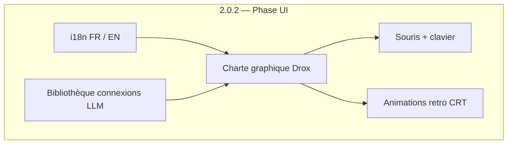

# Ligne produit `2.0.2` — Drox TUI · Phase UI

**Version produit** : `2.0.2` (en cours)  
**Branche Git** : `2.0.2`  
**Moteur** : dérivé du **moteur agent Drox IDE `1.5.0`**  
**Prédécesseur** : [`2.0.1`](../2.0.1/README.md) (clôturée, release OR publiée)

---

## Objectif de la ligne

Transformer **Drox TUI** en une expérience terminal **identitaire** : noir et vert phosphore, références retro-futuristes, interactions souris + clavier, animations travaillées, interface **FR/EN**, et **bibliothèque de connexions LLM** (presets cloud + profils personnalisés).

---

## Documents

| Document | Rôle |
|---|---|
| [**CHARTE-GRAPHIQUE.md**](CHARTE-GRAPHIQUE.md) | **Charte visuelle et UX** — couleurs, typographie, références Quake 2 / Pip-Boy / CRT 80s, souris, animations |
| [PLAN-I18N.md](PLAN-I18N.md) | Internationalisation FR/EN, choix utilisateur, architecture strings |
| [PLAN-CONNEXIONS-LLM.md](PLAN-CONNEXIONS-LLM.md) | Bibliothèque de profils LLM (Ollama cloud/local, vLLM, custom headers) |
| [CHECKLIST.md](CHECKLIST.md) | Checklist tests manuels phase 2 |

---

## Principes directeurs

1. **Identité Drox** — le TUI doit être reconnaissable en une seconde (noir profond, vert phosphore, monospace).
2. **Retro sans sacrifice UX** — esthétique années 80 / CRT, mais navigation moderne (souris, focus clair, feedback immédiat).
3. **Local-first inchangé** — la charte ne remet pas en cause la certification locale ; le réseau reste opt-in (LLM distant, outils web, MAJ).
4. **Extensible** — thème « Drox » par défaut ; les thèmes legacy (`dark`, `light`, …) peuvent rester en secours.
5. **Connexions LLM explicites** — presets documentés pour hébergeurs connus ; profil custom pour serveurs perso (headers, tokens).

---

## Périmètre hors 2.0.2 (pour l'instant)

- Refonte moteur agent / nouveaux outils
- Client macOS ARM (release OR)
- MAJ opt-in automatique (planifié, pas bloquant UI)

---

## Références code actuelles

| Zone | Fichier |
|---|---|
| Thèmes | `drox/crates/drox-tui/src/ui/theme.rs` |
| Préférences | `drox/crates/drox-tui/src/engine/preferences.rs` |
| Connexion LLM | `drox/crates/drox-tui/src/engine/llm_connection.rs` |
| Config LLM moteur | `drox/crates/drox-llm/src/config.rs` |
