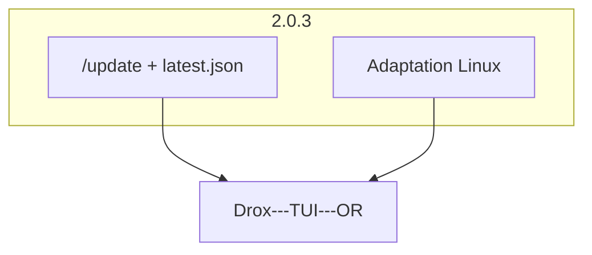

# Ligne produit `2.0.3` — Drox TUI · MAJ opt-in + Linux

**Version produit** : `2.0.3` (en cours)  
**Branche Git** : `2.0.3`  
**Moteur** : dérivé du **moteur agent Drox IDE `1.5.0`**  
**Prédécesseur** : [`2.0.2`](../2.0.2/README.md) (clôturée, release OR [v2.0.2](https://github.com/DroxKiwi/Drox---TUI---OR/releases/tag/v2.0.2))

---

## Objectif de la ligne

1. **Livrer `/update`** — commande visible (palette slash, `/help`), vérification opt-in vers le dépôt OR, bandeau non bloquant (reprise du [plan 2.0.1](../2.0.1/PLAN-UPDATE.md)).
2. **Parité Linux** — TUI utilisable et packagé sur Linux x64 avec le même niveau de finition que Windows (hors installateur graphique Inno).

---

## Documents

| Document | Rôle |
|---|---|
| [PLAN-UPDATE.md](PLAN-UPDATE.md) | Implémentation `/update`, prefs, bandeau, publication `latest.json` |
| [PLAN-LINUX.md](PLAN-LINUX.md) | Parité UX, packaging, presse-papiers, souris, tests |
| [CHECKLIST.md](CHECKLIST.md) | Suivi QA et release |

---

## Principes

1. **Opt-in strict** — aucune requête réseau MAJ sans consentement explicite (`/update on` ou `/update check`).
2. **Local-first inchangé** — la certification locale du README reste vraie par défaut.
3. **Une commande, un chemin** — `/update` doit apparaître partout où l'utilisateur cherche une commande (palette `/`, `/help`, suggestions).
4. **Linux first-class** — pas un port « best effort » : build release, archive OR, comportements documentés.

---

## Périmètre hors 2.0.3

- Installateur graphique Linux (`.deb` / AppImage) — archive `tar.gz` + `install.sh` suffisent
- macOS ARM
- Auto-update silencieuse sans confirmation utilisateur

---

## Références code

| Zone | Fichier |
|---|---|
| Palette slash | `drox/crates/drox-tui/src/slash/palette.rs` |
| Router slash | `drox/crates/drox-tui/src/slash.rs` |
| Préférences | `drox/crates/drox-tui/src/engine/preferences.rs` |
| Packaging Linux | `packaging/build-and-pack-linux.sh` |
| Publication OR | `packaging/publish-or.ps1` |
