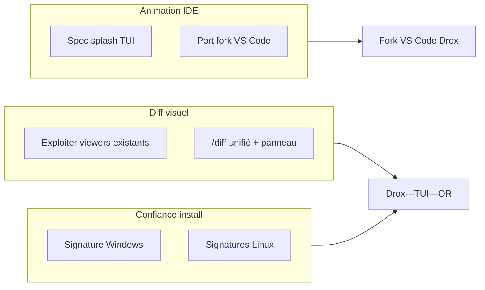

# Ligne produit `2.0.4` — Drox TUI · Diff visuel + confiance install + animation IDE

**Version produit** : `2.0.4` (planification)  
**Branche Git** : `2.0.4` (à créer au démarrage implémentation)  
**Moteur** : dérivé du **moteur agent Drox IDE `1.5.0`**  
**Prédécesseur** : [`2.0.3`](../2.0.3/README.md) — [release OR v2.0.3](https://github.com/DroxKiwi/Drox---TUI---OR/releases/tag/v2.0.3)

---

## Objectifs de la ligne

| # | Thème | Résumé |
|---|---|---|
| 1 | **Diff visuel TUI** | Réutiliser `LinesViewer`, `similar`, previews permission — aujourd’hui sous-exploités ; `/diff` n’affiche que `git status` + `--stat`. |
| 2 | **Confiance Windows / Linux** | Certificat éditeur (Authenticode) + signatures artefacts OR ; réduire alertes SmartScreen / « éditeur inconnu ». |
| 3 | **Animation lancement IDE** | Porter le splash « DROX » vers le fork VS Code — spec + code dans [`docs/animation-start/`](../animation-start/README.md). |

---

## Documents

| Document | Rôle |
|---|---|
| [PLAN-VISUAL-DIFF.md](PLAN-VISUAL-DIFF.md) | Inventaire code existant, lacunes, jalons M1–M4 |
| [PLAN-CODE-SIGNING.md](PLAN-CODE-SIGNING.md) | Authenticode, Inno Setup, Linux GPG, coûts, pipeline |
| [CHECKLIST.md](CHECKLIST.md) | Suivi QA et release |
| [../animation-start/README.md](../animation-start/README.md) | Animation splash Drox → fork VS Code |

---

## Principes

1. **Réutiliser avant de réécrire** — le diff unifié coloré existe déjà (`lines_viewer`, `tool_output`, `permission_preview`) ; la 2.0.4 l’expose dans le flux utilisateur (`/diff`, navigation).
2. **Confiance = processus** — signature certificat + empreintes publiées + réputation SmartScreen ; pas de « contournement » opaque.
3. **Même identité Drox** — splash TUI et IDE partagent logo ASCII, palette phosphore, timing (voir animation-start).

---

## Périmètre hors 2.0.4

- Diff 3-way merge interactif (style IDE complet)
- Notarisation macOS
- Installateur `.msi` / `.deb` signé Microsoft Store
- Plugin marketplace VS Code public

---

## Références code (état actuel)

| Zone | Fichier |
|---|---|
| Viewer diff unifié | `drox/crates/drox-tui/src/view/lines_viewer.rs` |
| Diff outils agent | `drox/crates/drox-tui/src/view/tool_output.rs` |
| Preview permission | `drox/crates/drox-tui/src/view/permission_preview.rs` |
| Génération diff | `drox/crates/drox-tools/src/diff_util.rs` |
| `/diff` (git stat seulement) | `drox/crates/drox-tui/src/engine/diff_cmd.rs` |
| Boot splash TUI | `drox/crates/drox-tui/src/ui/boot_splash.rs` |
| Installateur Windows | `packaging/windows/drox-tui-setup.iss` |
