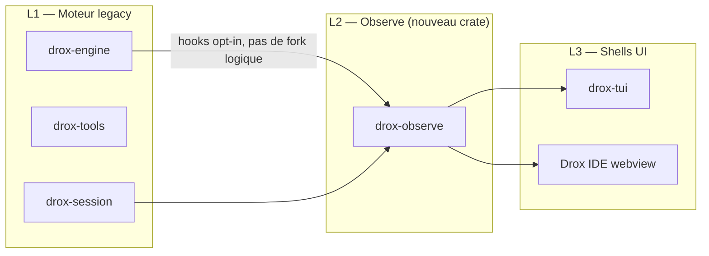

# Architecture — Externalisation des features (2.0.5)

> **Objectif** : dissocier fortement les nouveautés 2.0.5 du **moteur legacy** (`drox-engine`, boucle `tui_mono`) pour limiter les effets de bord et **porter les features vers Drox IDE** (fork VS Code) sans réécrire le TUI.

---

## Problème

Aujourd’hui, une partie significative de la logique produit vit dans `drox-tui` (layout, fil, collecte changements) avec des accès directs au moteur. Enrichir `AgentEvent` ou `app/run.rs` pour chaque feature UI augmente le risque de :

- régressions sur le run agent ;
- code non réutilisable côté IDE (webview ≠ ratatui) ;
- rollback coûteux si une feature pose problème.

---

## Stratégie : trois couches



### L1 — Moteur legacy (touch minimal)

**Interdit sans review** : refactor boucle agent, changement protocole phases, nouveaux tools obligatoires.

**Autorisé** :

- Émettre des événements **déjà prévus** (`ContextSnip`, `ToolFinish`, …).
- Hook optionnel post-tour : `observe::on_turn_end(&messages)` — feature flag `DROX_OBSERVE=1`.
- Extension `AgentEvent` **additive** uniquement (`#[non_exhaustive]` déjà en place).

### L2 — `drox-observe` (nouveau)

Crate **sans dépendance TUI** :

| Module | Rôle |
|---|---|
| `beat` | `BeatRegistry`, assignation A1…An |
| `manifest` | `ContextManifestBuilder` |
| `changes` | Agrégation `RunChangesSnapshot` |
| `map_view` | Fusion manifest + workspace map |
| `event` | `ObserveEvent` (stream UI-neutral) |
| `adapter` | Écoute `AgentEvent` → met à jour état |

**Dépendances** : `drox-types`, `drox-session`, `serde` — **pas** `ratatui`, **pas** `drox-tui`.

### L3 — Shells

| Shell | Rôle |
|---|---|
| `drox-tui` | `PaneManager`, widgets ratatui, consomme snapshots observe |
| Drox IDE | Extension TS consomme même JSON via RPC / fichier session |

---

## Contrat `ObserveEvent`

Flux parallèle au fil agent — l’UI **s’abonne**, ne parse pas le transcript :

```rust
// Concept — drox-observe/src/event.rs
pub enum ObserveEvent {
    BeatAssigned { beat: BeatRecord },
    ContextSnapshot { manifest: ContextManifest },
    ChangesUpdated { changes: RunChangesSnapshot },
    MapViewUpdated { view: MapViewSnapshot },
}
```

Feature flags (env ou prefs) :

| Flag | Feature |
|---|---|
| `observe.beat_id` | F02 |
| `observe.context_manifest` | F03 |
| `observe.changes_panel` | F04 |
| `observe.map_view` | F05 |
| `observe.multi_pane` | F01 (TUI only — layout local) |

Désactiver un flag = retour comportement 2.0.4 **sans** toucher L1.

---

## Portage IDE

1. **Types stables** — fiches [`docs/features/`](../features/README.md) + JSON exemples.
2. **Pas de ratatui** dans observe — IDE réimplémente widgets.
3. **Stream** — shim RPC existant (`drox-cli/jsonrpc`) peut relayer `ObserveEvent` comme sous-flux `agent/observe`.
4. **Référence** — [`VSCODE-FORK.md`](../animation-start/VSCODE-FORK.md) pour points d’accroche workbench.

Ordre de port suggéré IDE : **F04** (diff) → **F02** (timeline) → **F03/F05** (contexte) → **F01** (layout).

---

## Migration code existant 2.0.4

| Aujourd’hui | Cible 2.0.5 |
|---|---|
| `RunFileChange` dans `tool_output.rs` | Déplacer agrégation → `drox-observe::changes`, TUI = renderer |
| Collecte `run_file_changes` dans `app/run.rs` | Adapter observe écoute `ToolFinish` |
| `WorkspaceMapStore` moteur | Reste L1 ; **lecture** via observe pour F05 |
| Diff render | Reste L3 (`view/diff_render.rs`) |

Pas de big-bang : M0 shell vide + observe stub, puis brancher feature par feature.

---

## Critères « bien externalisé »

1. Désactiver F0x ne change **aucun** comportement agent mesurable (tests engine inchangés).
2. `cargo test -p drox-engine` passe sans activer observe.
3. Snapshot JSON observe documenté et versionné (`observe_schema_version`).
4. Une feature portable a une fiche dans `docs/features/`.

---

## Fichiers cibles (implémentation future)

| Fichier | Action |
|---|---|
| `drox/crates/drox-observe/` | **Créer** |
| `drox/crates/drox-tui/src/observe/` | Adaptateur TUI → subscriptions |
| `drox/crates/drox-tui/src/panes/` | F01 layout |
| `drox/crates/drox-engine/src/agent.rs` | Hook opt-in fin de tour (minimal) |
| `drox/crates/drox-cli/src/jsonrpc/` | Relay observe (optionnel M4) |
