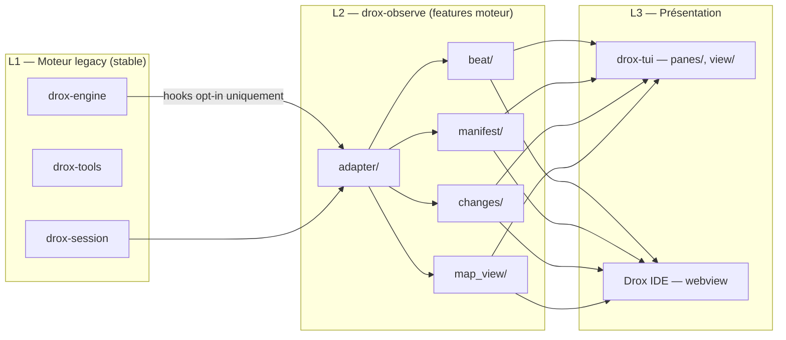

# Architecture — Externalisation des features moteur (2.0.5)

> **Objectif** : le **code** des nouveautés 2.0.5 vit dans des **modules / crate séparés** du moteur legacy (`drox-engine`, boucle `tui_mono`) — pas dans un arbre doc `docs/features/`. La doc produit reste dans [`docs/2.0.5/`](README.md) ; le découpage code est ici.

---

## Problème

Aujourd’hui, logique observe, collecte changements et accès carte workspace sont **mélangés** à `drox-tui` et au fil agent. Chaque feature UI qui touche `agent.rs` ou `app/run.rs` augmente le risque de :

- régressions sur le run agent ;
- effets de bord difficiles à isoler ;
- port IDE coûteux (logique noyée dans ratatui).

---

## Stratégie : code en trois couches



### L1 — Moteur legacy (touch minimal)

**Interdit sans review** : refactor boucle agent, changement protocole phases.

**Autorisé** :

- Événements **existants** (`ContextSnip`, `ToolFinish`, `PhaseEnter`, …).
- Un seul hook opt-in : adaptateur observe branché sur le stream `AgentEvent`.
- Extension `AgentEvent` **additive** (`#[non_exhaustive]`).

### L2 — `drox-observe` — une feature = un module

| Module | Feature | Spec doc |
|---|---|---|
| `beat/` | F02 Beat ID | [F02-beat-id-correlation.md](F02-beat-id-correlation.md) |
| `manifest/` | F03 Context manifest | [F03-context-manifest.md](F03-context-manifest.md) |
| `changes/` | F04 Changements run | [F04-run-changes-panel.md](F04-run-changes-panel.md) |
| `map_view/` | F05 Carte workspace | [F05-workspace-map-view.md](F05-workspace-map-view.md) |
| `adapter/` | Pont `AgentEvent` → état observe | — |
| `event.rs` | `ObserveEvent` (stream UI-neutral) | — |

**Pas de dépendance** : `ratatui`, `crossterm`, `drox-tui`.

Feature flags (compile-time ou prefs) :

| Flag | Module |
|---|---|
| `observe_beat` | `beat/` |
| `observe_manifest` | `manifest/` |
| `observe_changes` | `changes/` |
| `observe_map` | `map_view/` |

Désactiver un flag = module stub / no-op ; **L1 inchangé**.

### L3 — TUI / IDE

| Composant | Feature | Emplacement code |
|---|---|---|
| F01 Multi-pane | Layout seul | `drox-tui/src/panes/` |
| Rendu diff | Consomme `changes/` snapshot | `drox-tui/src/view/` (existant 2.0.4) |
| Subscription observe | Adaptateur fin | `drox-tui/src/observe/` |

F01 est **pure UI TUI** ; les features F02–F05 passent par L2.

---

## Contrat `ObserveEvent`

```rust
// drox-observe/src/event.rs — concept
pub enum ObserveEvent {
    BeatAssigned { beat: BeatRecord },
    ContextSnapshot { manifest: ContextManifest },
    ChangesUpdated { changes: RunChangesSnapshot },
    MapViewUpdated { view: MapViewSnapshot },
}
```

L’UI **s’abonne** au flux observe ; elle ne recalcule pas le contexte LLM ni les beats.

---

## Migration depuis 2.0.4

| Code actuel | Cible |
|---|---|
| `run_file_changes` dans `app/run.rs` | `drox-observe::changes` |
| `RunFileChange` types | `drox-observe` (+ re-export TUI si besoin) |
| Lecture `WorkspaceMapStore` pour UI | `drox-observe::map_view` |
| Diff render | Reste TUI (`view/diff_render.rs`) |

Ordre implémentation : crate stub → `adapter/` → `changes/` + `beat/` → `manifest/` + `map_view/` → `panes/` (F01).

---

## Critères « bien externalisé » (code)

1. `cargo test -p drox-engine` passe **sans** activer observe.
2. `cargo test -p drox-observe` couvre chaque module isolément.
3. Désactiver un flag observe ne change **aucun** comportement agent.
4. Types publics `drox-observe` documentés dans les fiches [FEATURES.md](FEATURES.md) (JSON exemples).
5. Port IDE = consommer `drox-observe` (crate Rust partagé) ou JSON RPC — **sans** copier la logique depuis `drox-tui`.

---

## Fichiers cibles

| Chemin | Action |
|---|---|
| `drox/crates/drox-observe/` | **Créer** — modules feature |
| `drox/crates/drox-tui/src/observe/` | Subscription L2 |
| `drox/crates/drox-tui/src/panes/` | F01 layout |
| `drox/crates/drox-engine/src/agent.rs` | Hook stream → adapter (minimal) |

Index specs : [FEATURES.md](FEATURES.md) · Plan intégration : [PLAN-MULTI-PANE.md](PLAN-MULTI-PANE.md)
