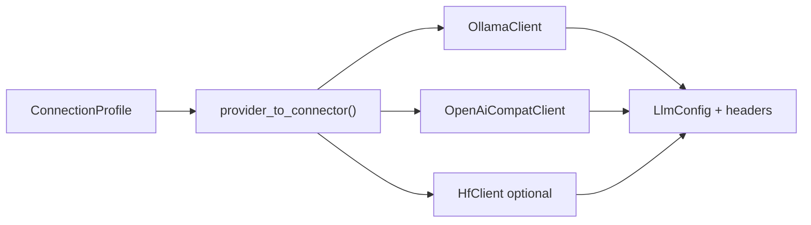

# Plan — Connexions LLM self-hosted & cloud (ligne 2.0.5)

> **Vision** : l’utilisateur choisit **Self-hosted** ou **Cloud**, puis un **moteur** ou **prestataire** ; le formulaire et le connecteur HTTP respectent la **doc officielle**. Les connexions cloud actuelles (Ollama Cloud seul, souvent non fonctionnel) sont **refaites proprement**.

**Références prestataires** : [PROVIDERS.md](PROVIDERS.md)  
**Base 2.0.2** : [PLAN-CONNEXIONS-LLM.md](../2.0.2/PLAN-CONNEXIONS-LLM.md) (livré mais incomplet côté cloud)

---

## Problème

| Aujourd’hui | Manque |
|---|---|
| Wizard `Personal` / `Cloud` | Cloud = **Ollama Cloud uniquement** ; autres prestataires absents |
| Presets `connection_library` | URLs / auth **approximatifs** ; pas de connecteur par cloud |
| `probe_connection` | Orienté Ollama local ; échecs cloud peu explicites |
| OpenAI-compat | vLLM / LM Studio partiellement branchés ; cloud HF/OVH/Mistral/Scaleway **non** |
| Headers custom | Modèle présent ; UI self-hosted **Custom** peu guidée |

---

## Cible UX

### Étape 1 — Déploiement (inchangé conceptuellement)

```text
┌─ CONNEXION IA ─────────────────────────────────────────┐
│  > Self-hosted (chez vous)                           │
│    Cloud (prestataire distant)                       │
└──────────────────────────────────────────────────────┘
```

### Étape 2a — Self-hosted : moteur

| Choix | Formulaire |
|---|---|
| **Ollama** | URL (défaut `127.0.0.1:11434`), headers optionnels |
| **vLLM** | URL `/v1`, Bearer optionnel, headers |
| **LM Studio** | URL `/v1`, Bearer optionnel |
| **OpenAI-compatible** | URL, auth, **table headers** |
| **Personnalisé** | Idem OpenAI-compat + nom profil |

### Étape 2b — Cloud : prestataire

| Choix | Champs spécifiques (voir PROVIDERS.md) |
|---|---|
| **Ollama Cloud** | API key Bearer |
| **Mistral** | API key, modèle |
| **OVHcloud** | Token, endpoint / région, modèle |
| **Hugging Face** | HF token, modèle `org/name` |
| **Scaleway** | Secret key, modèle |

Chaque écran cloud affiche un lien **Documentation officielle** vers la section [PROVIDERS.md](PROVIDERS.md).

### Étape 3 — Test & modèle

- **Tester** : probe adapté au `LlmProvider` / connecteur.
- **Sélection modèle** : liste si API le permet ; sinon saisie manuelle validée.
- **Erreurs** : message actionnable (401 → vérifier token, 404 → URL, etc.).

---

## Architecture connecteurs



### Extensions `LlmProvider`

```rust
pub enum LlmProvider {
    // Self-hosted (existant)
    OllamaLocal,
    Vllm,
    LmStudio,
    OpenAiCompatible,
    Custom,
    // Cloud (nouveau)
    OllamaCloud,
    MistralCloud,
    OvhCloud,
    HuggingFaceCloud,
    ScalewayCloud,
}
```

`CloudProviderChoice` dans `state.rs` aligné sur cette liste.

### `profile_to_llm_config`

- Mapping **auth** → headers (Bearer, ApiKeyHeader, CustomHeaders) — déjà amorcé.
- **base_url** normalisée (trailing slash, suffixe `/v1`).
- **Modèle** : champ obligatoire avant run agent.

---

## Jalons

### C0 — Audit & fixes rapides

- [ ] Reproduire échecs Ollama Cloud / vLLM / LM Studio (issues ou notes)
- [ ] Corriger `profile_to_llm_config` + probe pour presets existants
- [ ] Tests HTTP mock par type auth

### C1 — Self-hosted complet

- [ ] Formulaires par moteur (Ollama, vLLM, LM Studio, OpenAI-compat)
- [ ] Éditeur **headers** clé/valeur (self-hosted + Custom)
- [ ] Probe généralisé `probe_connection(profile) -> Result<Vec<String>, Error>`
- [ ] i18n FR/EN libellés moteurs

### C2 — Cloud prestataires

- [ ] `MistralCloud` connecteur OpenAI-compat
- [ ] `OvhCloud` connecteur (URL + auth doc OVH)
- [ ] `HuggingFaceCloud` connecteur
- [ ] `ScalewayCloud` connecteur
- [ ] `OllamaCloud` revu selon doc officielle
- [ ] Écran formulaire **par prestataire** (pas un seul formulaire générique)
- [ ] Lien doc officielle dans chaque écran

### C3 — Finitions release

- [ ] Migration profils existants (`connection_profiles` JSON)
- [ ] `/doctor` : vérif connexion active
- [ ] Doc utilisateur README (section moteurs mise à jour)
- [ ] RELEASE_NOTES 2.0.5

---

## Tests d’acceptation

1. **Ollama local** : liste modèles + run agent OK.
2. **vLLM local** : `/v1/models` + chat OK.
3. **LM Studio** : idem OpenAI-compat local.
4. **OpenAI-compat + 2 headers custom** : headers présents en requête (test mock).
5. **Chaque cloud** (avec compte test) : probe OK + un message agent OK.
6. Profil cloud mal configuré → message d’erreur **clair** (pas panic / erreur générique).

---

## Risques

| Risque | Mitigation |
|---|---|
| APIs cloud évoluent | Lien doc + version `provider_schema_version` dans profil |
| HF multi-endpoints | Choix explicite router vs inference API dans formulaire |
| Secrets en clair | Documenter ; keychain = hors 2.0.5 |
| Scope creep multi-pane | Reporté [2.0.6](../2.0.6/README.md) |

---

## Documents liés

| Document | Rôle |
|---|---|
| [PROVIDERS.md](PROVIDERS.md) | Specs par prestataire |
| [CHECKLIST.md](CHECKLIST.md) | Suivi |
| [PLAN-CONNEXIONS-LLM.md](../2.0.2/PLAN-CONNEXIONS-LLM.md) | Livraison 2.0.2 |
