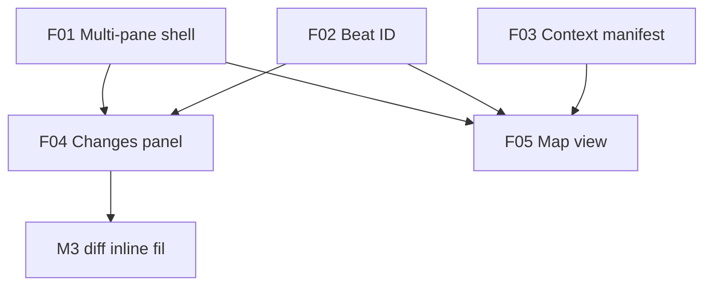

# Plan — Poste de pilotage multi-pane (ligne 2.0.5)

> **Vision** : le TUI devient un **triptyque configurable** (fil · carte contexte · changements+diff), corrélé par **beat IDs** colorés (A1, A2…), alimenté par une couche **observe** découplée du moteur legacy.

**Architecture code** : [ARCHITECTURE-FEATURES.md](ARCHITECTURE-FEATURES.md)  
**Specs features** : [FEATURES.md](FEATURES.md)

---

## Problème

| Aujourd’hui (2.0.4) | Manque |
|---|---|
| Diff overlay `/diff`, bandeau fin de run | Pas de vue **live** des changements pendant le run |
| `WorkspaceMapStore` côté moteur | UI ne montre pas la **connaissance contextuelle** réelle |
| Fil unique | Perte de contexte sur runs longs (15+ tools) |

---

## Cible UX

```text
┌─────────────────┬──────────────────┬─────────────────────────┐
│ Fil agent       │ Carte contexte   │ Changements + diff      │
│ (A12 file_read) │ ● src/lib.rs A12 │ ▸ RULES.md A14  [diff]  │
│                 │ ○ old.md évincé  │   src/lib.rs A12        │
└─────────────────┴──────────────────┴─────────────────────────┘
│ Composer (pleine largeur)                                       │
└─────────────────────────────────────────────────────────────────┘
  [Masquer carte] [Masquer diff]     Tab · focus   Esc · restore
```

- Panneaux **toggle** individuellement (densité terminal).
- **Même couleur / beat ID** sur les trois colonnes (F02).
- Carte = **contexte LLM actuel** (F03), pas seulement fichiers visités.
- Rendu carte = **arbre lisible** (F05), pas mermaid.

---

## Jalons

### M0 — Shell + observe stub

- [ ] Crate `drox-observe` (types, `ObserveEvent`, feature flags)
- [ ] F01 : `PaneManager`, toggles, focus Tab, fallback terminal étroit
- [ ] Adaptateur TUI : subscription observe (mock / vide)
- [ ] Tests : layout seul, engine tests inchangés

### M1 — Changements live (F04 + F02 partiel)

- [ ] `RunChangesSnapshot` alimenté depuis `ToolFinish`
- [ ] Beat ID sur chaque tool fichier
- [ ] Panneau droit : liste + diff sélectionné (`j`/`k`, clic)
- [ ] Corrélation couleur fil ↔ panneau changements

### M2 — Contexte réel (F03 + F05)

- [ ] `ContextManifestBuilder` post-tour LLM
- [ ] Panneau carte : arbre + états (`●` `○` `◇` `▲`)
- [ ] Scroll auto vers dernier beat
- [ ] Corrélation beat sur les trois panes

### M3 — Finitions

- [ ] Diff inline tronqué dans fil (optionnel — ex [PLAN-DIFF-INLINE.md](PLAN-DIFF-INLINE.md))
- [ ] i18n FR/EN panes + légende carte
- [ ] Prefs : layout mémorisé
- [ ] Non-régression overlay `/diff` 2.0.4

### M4 — Portabilité IDE (doc + hook)

- [ ] Schéma JSON `observe_schema_version` documenté
- [ ] Spec relay RPC `agent/observe` (optionnel)
- [ ] Matrice port IDE par feature (fiches F01–F05)

---

## Dépendances entre features



---

## Risques

| Risque | Mitigation |
|---|---|
| Touch moteur trop invasif | Hooks opt-in ; observe crate isolée |
| Manifest contexte imprécis | V1 honnête + label « ~approx tokens » |
| Terminal < 100 cols | Presets `feed_only`, overlay fallback |
| Scope creep mermaid | Explicitement hors scope F05 v1 |

---

## Critères d’acceptation release

1. Utilisateur masque/affiche chaque pane sans perdre le run.
2. Fichier modifié visible **pendant** le run avec diff au clic.
3. Carte distingue **en contexte** vs **évincé** vs **modifié**.
4. Beat A-id visible et cohérent fil + carte + changements.
5. `observe.*` désactivé → comportement 2.0.4 préservé.
6. Fiches features complètes pour port IDE.

---

## Documents liés

| Document | Rôle |
|---|---|
| [ARCHITECTURE-FEATURES.md](ARCHITECTURE-FEATURES.md) | Découplage moteur / observe / UI |
| [PLAN-DIFF-INLINE.md](PLAN-DIFF-INLINE.md) | Sous-feature M3 (historique) |
| [CHECKLIST.md](CHECKLIST.md) | Suivi implémentation |
| [FEATURES.md](FEATURES.md) | Index specs F01–F05 |
