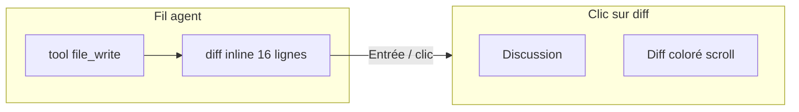

# Ligne produit `2.0.5` — Drox TUI · Diff inline dans le fil

**Version produit** : `2.0.5` (dev)  
**Branche Git** : `2.0.5`  
**Release OR publique** : `2.0.4` (Windows)  
**Moteur** : dérivé du **moteur agent Drox IDE `1.5.0`**  
**Prédécesseur** : [`2.0.4`](../2.0.4/README.md) — diff overlay `/diff`, bandeau fin de run (clôturée)

---

## Objectif

Afficher les **diffs de fichiers dans le fil de discussion**, comme le TUI de **Claude Code** — pas seulement dans un overlay plein écran.

L’utilisateur voit le patch coloré **inline** après chaque `file_write` / `file_edit`. Un clic ouvre une **vue scindée** : fil à gauche, diff complet à droite.

---

## Documents

| Document | Rôle |
|---|---|
| [PLAN-DIFF-INLINE.md](PLAN-DIFF-INLINE.md) | Spec UX, architecture layout, jalons M1–M4 |
| [CHECKLIST.md](CHECKLIST.md) | Suivi implémentation et QA |

---

## Périmètre hors 2.0.5

- Diff 3-way merge interactif
- Édition du fichier depuis le panneau diff
- Synchronisation scroll fil ↔ diff (nice-to-have, pas bloquant M1)

---

## Réutilisation 2.0.4

La 2.0.5 **s’appuie** sur le travail 2.0.4 (à ne pas réécrire) :

| Composant existant | Fichier |
|---|---|
| Patch unifié coloré | `view/lines_viewer.rs`, `view/diff_render.rs` |
| Troncature fil + hint | `view/tool_output.rs` (`append_unified_diff_block`) |
| Overlay scroll | `widgets/scroll_overlay.rs` |
| Collecte fin de run | `tool_output::RunDiffSummary` |

La 2.0.5 change surtout **où** et **comment** le diff est présenté (fil + split), pas la génération du patch.
