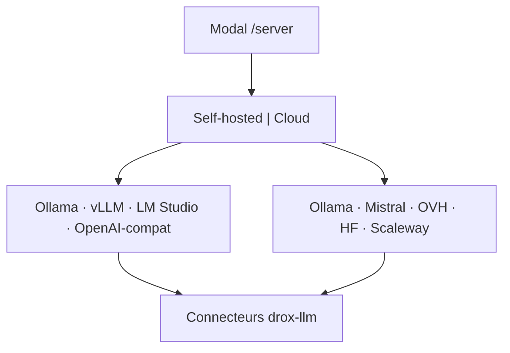

# Ligne produit `2.0.5` — Drox TUI · Connexions LLM (self-hosted & cloud)

**Version produit** : `2.0.5` (dev)  
**Branche Git** : `2.0.5`  
**Release OR publique** : `2.0.4` (Windows)  
**Moteur** : dérivé du **moteur agent Drox IDE `1.5.0`** — pas de changement boucle agent  
**Prédécesseur** : [`2.0.4`](../2.0.4/README.md) — diff overlay (clôturée)

---

## Objectif

Rendre les **connexions LLM réellement fonctionnelles** : choix **self-hosted** ou **cloud**, formulaires **par prestataire** conformes à la **documentation officielle**, connecteurs adaptés, **headers personnalisables** en self-hosted.

> **Constat** : la bibliothèque profils 2.0.2 (`connection_library.rs`) et l’assistant `/server` existent, mais les connexions **cloud** (et une partie des self-hosted) **ne fonctionnent pas** en pratique — URLs, auth, endpoints et clients HTTP ne suivent pas les specs officielles.

---

## Documents

| Document | Rôle |
|---|---|
| [PLAN-CLOUD-CONNECTIONS.md](PLAN-CLOUD-CONNECTIONS.md) | Vision UX, connecteurs, jalons C0–C3 |
| [PROVIDERS.md](PROVIDERS.md) | Références doc officielle + contrat par prestataire |
| [CHECKLIST.md](CHECKLIST.md) | Suivi implémentation |

---

## Périmètre 2.0.5

### Self-hosted (moteurs)

| Moteur | API | Headers custom |
|---|---|---|
| **Ollama** | API native Ollama | Oui (`extra_headers`) |
| **vLLM** | OpenAI-compatible `/v1` | Oui |
| **LM Studio** | OpenAI-compatible local | Oui |
| **OpenAI-compatible** | URL + schéma OpenAI | Oui |

### Cloud (prestataires)

| Prestataire | Formulaire dédié | Doc officielle |
|---|---|---|
| **Ollama Cloud** | URL + Bearer | [PROVIDERS.md](PROVIDERS.md#ollama-cloud) |
| **Mistral** | API key + endpoint | [PROVIDERS.md](PROVIDERS.md#mistral) |
| **OVHcloud AI Endpoints** | Token + région / URL | [PROVIDERS.md](PROVIDERS.md#ovhcloud) |
| **Hugging Face** | Token + modèle / provider | [PROVIDERS.md](PROVIDERS.md#hugging-face) |
| **Scaleway** | Secret key + endpoint | [PROVIDERS.md](PROVIDERS.md#scaleway) |

---

## Périmètre hors 2.0.5

- Multi-pane / `drox-observe` → [`2.0.6`](../2.0.6/README.md)
- Code signing / GPG Linux → [`2.0.7`](../2.0.7/README.md)
- Keychain OS pour secrets (piste ultérieure)

---

## Réutilisation existant

| Existant (2.0.2–2.0.4) | Usage 2.0.5 |
|---|---|
| `ConnectionProfile`, `AuthConfig`, `extra_headers` | Étendre providers cloud |
| `ai_server_dialog` (wizard deployment) | Écrans par prestataire |
| `connection_library.rs` | Presets + `profile_to_llm_config` |
| `drox-llm` `LlmConfig.headers` | Respect strict par connecteur |
| [`PLAN-CONNEXIONS-LLM.md`](../2.0.2/PLAN-CONNEXIONS-LLM.md) | Base livrée 2.0.2 — **corriger / compléter** |
