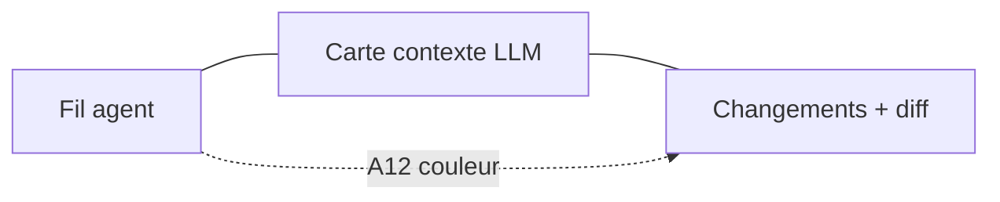

# Ligne produit `2.0.5` — Drox TUI · Poste de pilotage multi-pane

**Version produit** : `2.0.5` (dev)  
**Branche Git** : `2.0.5`  
**Release OR publique** : `2.0.4` (Windows)  
**Moteur** : dérivé du **moteur agent Drox IDE `1.5.0`** — **couche observe** nouvelle, moteur legacy touch minimal  
**Prédécesseur** : [`2.0.4`](../2.0.4/README.md) — diff overlay (clôturée)

---

## Objectif

Transformer le TUI en **poste de pilotage agent** : jusqu’à **3 vues simultanées** (fil · carte contexte · changements+diff), panneaux masquables, corrélés par **beat IDs** colorés (A1, A2…).

La release introduit surtout une **architecture features externalisées** (`drox-observe`) pour limiter les effets de bord moteur et **faciliter le port vers Drox IDE**.

---

## Documents

| Document | Rôle |
|---|---|
| [PLAN-MULTI-PANE.md](PLAN-MULTI-PANE.md) | Vision UX, jalons M0–M4 |
| [ARCHITECTURE-FEATURES.md](ARCHITECTURE-FEATURES.md) | Découplage moteur / observe / UI |
| [CHECKLIST.md](CHECKLIST.md) | Suivi implémentation |
| [`docs/features/`](../features/README.md) | **Catalogue features portables IDE** |
| [PLAN-DIFF-INLINE.md](PLAN-DIFF-INLINE.md) | Sous-feature M3 (diff fil — historique) |

---

## Features 2.0.5 (catalogue)

| ID | Feature | Jalon |
|---|---|---|
| F01 | Multi-pane shell (toggle) | M0 |
| F02 | Beat ID & corrélation couleur | M1 |
| F03 | Context manifest (connaissance LLM) | M2 |
| F04 | Panneau changements + diff live | M1 |
| F05 | Carte workspace lisible | M2 |

---

## Périmètre hors 2.0.5

- Graphe mermaid / layout graphique auto
- Édition fichier depuis panneau diff
- Relay RPC observe vers IDE (spec M4, impl IDE séparée)
- Code signing → [2.0.6](../2.0.6/README.md)

---

## Réutilisation 2.0.4

| Existant | Usage 2.0.5 |
|---|---|
| `diff_render`, `lines_viewer` | Panneau changements (F04) |
| `RunFileChange` | Base `RunChangesSnapshot` → observe |
| `WorkspaceMapStore` | Structure ; F03 pour état contextuel |
| Overlay `/diff` | Conservé ; fallback terminal étroit |
