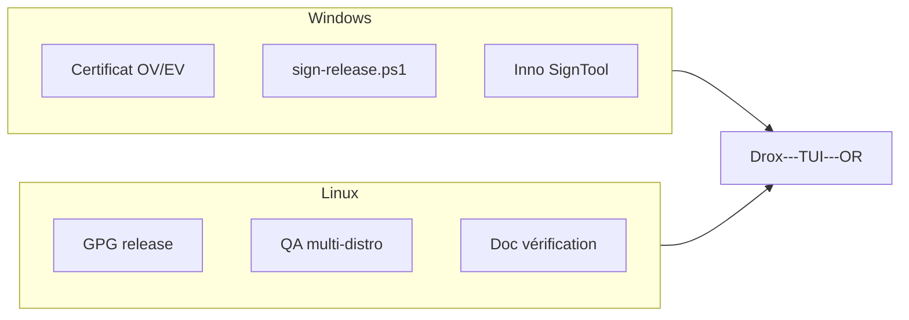

# Ligne produit `2.0.7` — Drox TUI · Confiance install + Linux avancé

**Version produit** : `2.0.7` (plan)  
**Branche Git** : `2.0.7` (à créer après clôture 2.0.4)  
**Moteur** : dérivé du **moteur agent Drox IDE `1.5.0`**  
**Prédécesseur** : [`2.0.6`](../2.0.6/README.md) — multi-pane · [`2.0.4`](../2.0.4/README.md) — diff visuel TUI

---

## Objectif

Renforcer la **confiance à l’installation** et la **maturité Linux** — reportés depuis le plan initial 2.0.4 :

1. **Code signing Windows** (Authenticode) — éditeur identifié, SmartScreen
2. **Signatures Linux** (GPG `.asc`) — chaîne de confiance au-delà du SHA256
3. **Préparation / QA Linux** — parité release, CI, doc installateur

---

## Documents

| Document | Rôle |
|---|---|
| [PLAN-CODE-SIGNING-LINUX.md](PLAN-CODE-SIGNING-LINUX.md) | Signing Windows/Linux, pipeline, QA |
| [CHECKLIST.md](CHECKLIST.md) | Suivi implémentation |

---

## Reprise depuis 2.0.4

Le contenu détaillé était dans [`docs/2.0.4/PLAN-CODE-SIGNING.md`](../2.0.4/PLAN-CODE-SIGNING.md) (référence archivée). La 2.0.7 **implémente** ce plan.

Linux de base (archive `tar.gz`, `publish-or`, CI Ubuntu) est déjà livré en **2.0.3** ; la 2.0.7 couvre **signing + QA approfondie**, pas le packaging minimal.

---

## Périmètre hors 2.0.7

- Notarisation macOS
- Installateur `.deb` / AppImage signé
- Microsoft Store
