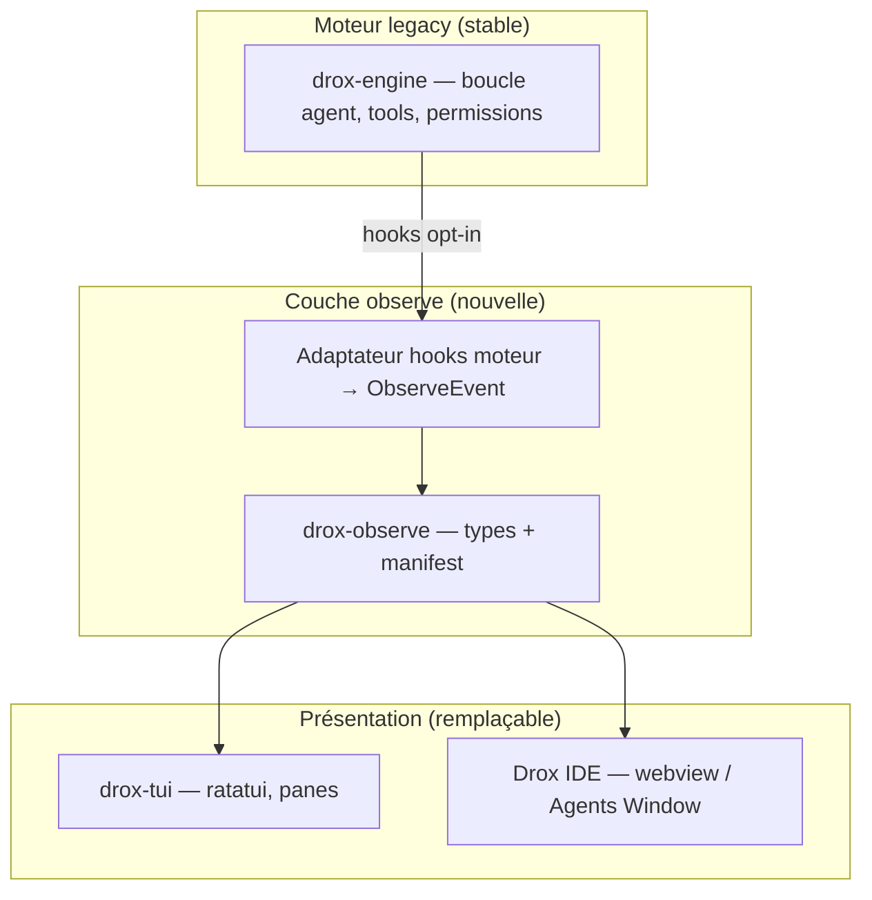

# Catalogue features — portable TUI ↔ IDE

> **Principe** : chaque feature est **spécifiée ici** (contrats de données + comportement), **implémentée** dans une couche découplée du moteur legacy, et **branchée** au TUI ou au fork VS Code via des adaptateurs fins.

Les fiches ne décrivent pas *où* le code vit aujourd’hui, mais *ce* qui doit rester stable pour un port IDE sans réécrire la boucle agent.

---

## Pourquoi externaliser

| Problème actuel | Effet externalisation |
|---|---|
| UI et moteur mélangés dans `drox-tui` | Side effects localisés ; rollback par feature flag |
| `AgentEvent` enrichi ad hoc | Couche **observe** avec types dédiés |
| Difficile à porter vers Drox IDE | Même JSON / mêmes structs Rust dans un crate partagé |
| Régressions « violentes » sur le run | Moteur legacy **inchangé** sauf hooks opt-in |

---

## Couches cibles

**Règle d’or** : `drox-observe` ne dépend **pas** de ratatui, crossterm, ni du code VS Code.

---

## Index des features

| ID | Fiche | Ligne 2.0.5 | Port IDE |
|---|---|---|---|
| **F01** | [Multi-pane shell](F01-multi-pane-shell.md) | M0 | Layout webview 3 colonnes |
| **F02** | [Beat ID & corrélation couleur](F02-beat-id-correlation.md) | M0–M1 | Timeline + surbrillance editor |
| **F03** | [Context manifest](F03-context-manifest.md) | M2 | Panel « contexte LLM » |
| **F04** | [Panneau changements + diff](F04-run-changes-panel.md) | M1 | Diff editor / multi-diff |
| **F05** | [Carte workspace lisible](F05-workspace-map-view.md) | M2 | Tree view explorateur |

---

## Contrat de portage IDE

1. **Types** : structs `serde` dans `drox-observe` → schéma JSON documenté par fiche.
2. **Flux** : `ObserveEvent` stream (ou snapshot polling) — **pas** parsing du fil TUI.
3. **UI** : réimplémentation native IDE ; **pas** embarquer ratatui.
4. **Feature flags** : chaque F0x activable séparément (`observe.beat_id`, `observe.context_manifest`, …).

Référence fork : [`docs/animation-start/VSCODE-FORK.md`](../animation-start/VSCODE-FORK.md).

---

## Versions

| Version produit | Features livrées |
|---|---|
| 2.0.4 | Diff overlay (hors catalogue — pré-externalisation) |
| **2.0.5** | F01–F05 (shell + observe) |
| 2.0.6 | Signing (hors catalogue UI) |
